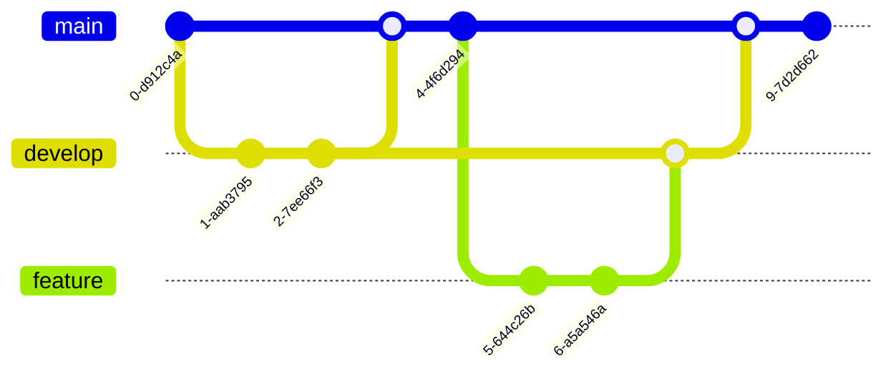

<!-- Mermaid-Unterstützung aktivieren -->

# Mermaid-Diagramme in Marp
### Verschiedene Diagrammtypen und Anwendungen

---

## Flussdiagramm (Flowchart)

---

## Sequenzdiagramm

---

## Klassendiagramm

---

## Gantt-Diagramm

---

## Kreisdiagramm (Pie Chart)

---

## Entity-Relationship-Diagramm

---

## Journey-Diagramm

---

## Gitgraph-Diagramm

---

## State-Diagramm

---

# Vielen Dank!

### Zusammenfassung
- Mermaid bietet verschiedene Diagrammtypen für unterschiedliche Anwendungsfälle
- Einfache Integration in Marp-Präsentationen
- Anpassbare Themes und Designs