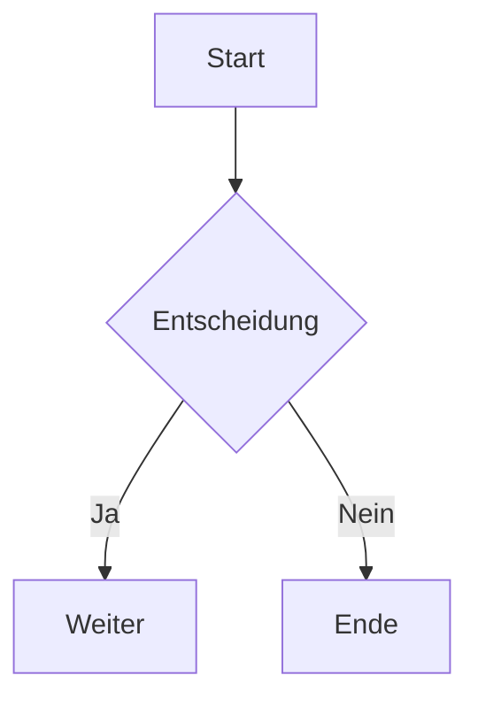

 \
 \
 \
 \
### Fotogrammetrie with Meshroom for unity 

---

- NP-Schweres Problem
Eine Klasse an Problemen für die es noch nicht die
---

## Animationen

<!-- Add transition effects -->

- Punkt 1 <!-- _class: fade-in -->
- Punkt 2 <!-- _class: fade-in -->
- Punkt 3 <!-- _class: fade-in -->

---

## Diagramme mit Mermaid

---

## Benutzerdefinierte Layouts

### Linke Seite
- Punkt 1
- Punkt 2

### Rechte Seite
- Punkt A
- Punkt B

---

## Erweiterte Bilder

---

## Tabellen mit Stil

| Spalte 1 | Spalte 2 | Spalte 3 |
|----------|----------|----------|
| Zelle 1  | Zelle 2  | Zelle 3  |
| Zelle 4  | Zelle 5  | Zelle 6  |

---

# Vielen Dank!

Kontakt: [email@example.com](mailto:email@example.com)

---

1.1 Software-Installation
Meshroom:

Download von Meshroom (kostenlos, Open-Source).

Installation gemäß Systemanforderungen (CUDA-fähige GPU empfohlen).

Zusatzsoftware (Optional):

Blender (für Nachbearbeitung der Meshes/Texturen).

Instant Meshes (Retopologie).

Substance Painter (Textur-Verbesserung).

1.2 Ordnerstruktur anlegen
Projektordner mit Unterordnern:

/Input_Images (Rohfotos).

/Meshroom_Projects (Meshroom-Dateien).

/Exports (FBX, OBJ, Texturen).

/PostProcessing (Blender-Dateien).

Phase 2: Fotoverarbeitung in Meshroom
2.1 Bildvorbereitung
Bildauswahl:

Nur scharfe, gut belichtete Bilder verwenden (verwackelte/überbelichtete aussortieren).

Empfohlen: 50–100 Fotos pro Person aus 360°-Perspektiven (Frontal, Seiten, Oberkörper).

Benennung:

Dateien nach Aufnahmewinkel sortieren (z. B. person_front_001.jpg, person_side_002.jpg).

2.2 Meshroom-Workflow
Bilder importieren:

Drag & Drop der Fotos in den Meshroom-Node-Graph.

Feature-Extraktion:

Node FeatureExtraction identifiziert Schlüsselpunkte in den Bildern.

Bildausrichtung (Structure-from-Motion):

Node StructureFromMotion berechnet Kamerapositionen und grobe 3D-Punktwolke.

Tipp: Bei Fehlern im Alignment SfM-Parameter anpassen (z. B. Describer Types: sift).

Tiefenkarten erstellen:

Node PrepareDenseScene → DepthMap → DepthMapFilter für präzise Tiefeninformationen.

Mesh-Generierung:

Node Meshing erstellt das 3D-Mesh aus der Punktwolke.

Einstellungen für Menschen:

MeshResolution: High (für Details wie Gesichtszüge).

MaxVertices: 2 Mio. (je nach GPU-Leistung).

Texturierung:

Node Texturing berechnet die UV-Maps und Farbtexturen.

Optimierung:

TextureSize: 8192x8192 (für hochauflösende Hautdetails).

FillHoles: Enabled (um Lücken zu schließen).

Phase 3: Nachbearbeitung (Post-Processing)
3.1 Mesh-Bereinigung (in Blender)
Import:

Exportiere Mesh aus Meshroom als .obj und importiere in Blender.

Arbeitsschritte:

Löschen von Artefakten (z. B. schwebende Punkte, Bodenreste).

Decimate-Modifier: Reduziere Polygone bei Bedarf (für Echtzeit-Anwendungen).

Sculpting: Feine Details manuell nachbearbeiten (z. B. Haare, Augenlider).

3.2 Retopologie (Optional)
Ziel: Erstellung eines optimierten, animierbaren Meshes.

Tools:

Blender RetopoFlow oder Instant Meshes für gleichmäßige Topologie.

UV Unwrapping: Neue UV-Maps für bessere Texturkontrolle.

3.3 Textur-Verfeinerung
Substance Painter:

Bump/Normal Maps hinzufügen (z. B. Hautporen).

Beleuchtungskorrektur (Ambient Occlusion, Roughness Maps).

Phase 4: Export & Integration
4.1 Exportformate
Für Unity/Unreal Engine:

.fbx (Mesh + Texturen + Materialien).

.glTF (Web-basierte Anwendungen).

Für Rendering:

.obj mit 4K-Texturen.

4.2 Unity-Optimierung
LODs (Level of Detail):

Erstelle vereinfachte Meshes für Entfernungen.

Shader-Anpassung:

Nutze URP/HDRP Shader für realistische Hautdarstellung.

Phase 5: Qualitätskontrolle & Iteration
Checkliste:

Sind alle Gesichtszüge scharf?

Gibt es Texturverzerrungen?

Funktioniert die Beleuchtung in der Zielumgebung?

Iteration:

Bei Fehlern: Schritt zurück (z. B. mehr Fotos aufnehmen oder Meshroom-Parameter anpassen).