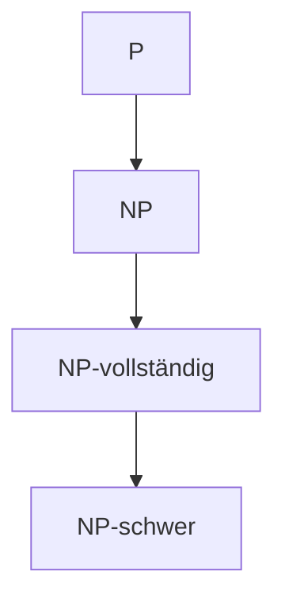

<!-- Mermaid-Unterstützung aktivieren -->

# NP-schwere Probleme
### Komplexitätstheorie und algorithmische Herausforderungen

---

## Was sind NP-schwere Probleme?

**Definition:** Ein Problem ist **NP-schwer**, wenn jedes Problem in NP auf dieses Problem in polynomieller Zeit reduzierbar ist.

- Ein Problem ist NP-schwer, wenn ein Algorithmus für dieses Problem verwendet werden könnte, um jedes Problem in NP zu lösen
- NP-schwere Probleme müssen selbst nicht in NP sein
- NP-vollständige Probleme sind NP-schwer UND in NP

---

## Komplexitätsklassen

- **P**: Probleme, die in polynomieller Zeit lösbar sind
- **NP**: Probleme, deren Lösungen in polynomieller Zeit überprüfbar sind
- **NP-vollständig**: In NP und NP-schwer
- **NP-schwer**: Mindestens so schwer wie alle Probleme in NP

---

## Mathematische Formalisierung

Ein Problem $L$ ist **NP-schwer**, wenn für jedes Problem $L'$ in NP gilt:

$$ L' \leq_P L $$

wobei $\leq_P$ eine polynomielle Reduktion bezeichnet.

Wenn $L$ auch in NP ist, dann ist $L$ **NP-vollständig**:

$$ L \text{ ist NP-vollständig} \Leftrightarrow L \in \text{NP} \text{ und } L \text{ ist NP-schwer} $$

---

## Klassisches Beispiel: Das Travelling Salesman Problem

**Problem:** Finde den kürzesten Rundweg durch $n$ Städte, der jede Stadt genau einmal besucht.

**Formalisierung:**
- Vollständiger Graph $G = (V, E)$ mit Gewichtsfunktion $w: E \rightarrow \mathbb{R}$
- Gesucht: Hamiltonkreis $H$ mit minimaler Summe der Kantengewichte

$$ \min_{H \in \mathcal{H}} \sum_{e \in H} w(e) $$

wobei $\mathcal{H}$ die Menge aller Hamiltonkreise in $G$ ist.

---

## Beispiele für NP-schwere Probleme

1. **Traveling Salesman Problem (TSP)**
   - Finde den kürzesten Rundweg durch alle Städte
   
2. **Knapsack Problem (Rucksackproblem)**
   - Maximiere den Wert der Gegenstände im Rucksack mit begrenztem Gewicht
   
3. **Clique Problem**
   - Finde eine vollständig verbundene Teilmenge von Knoten maximaler Größe
   
4. **Graph Coloring Problem (Graphfärbungsproblem)**
   - Färbe Knoten mit minimaler Anzahl von Farben, sodass benachbarte Knoten verschiedene Farben haben
   
5. **SAT (Boolean Satisfiability Problem)**
   - Finde eine Belegung von Variablen, die eine boolesche Formel erfüllt

---

## Das Rucksackproblem

**Formalisierung:**
- $n$ Gegenstände mit Gewichten $w_1, w_2, ..., w_n$ und Werten $v_1, v_2, ..., v_n$
- Rucksackkapazität $W$
- Gesucht: Teilmenge $S$ der Gegenstände, die den Wert maximiert

$$ \max_S \sum_{i \in S} v_i \quad \text{unter der Bedingung} \quad \sum_{i \in S} w_i \leq W $$

Als Entscheidungsproblem: Gibt es eine Teilmenge $S$ mit $\sum_{i \in S} v_i \geq V$ und $\sum_{i \in S} w_i \leq W$?

---

## NP-Vollständigkeit: Cook-Levin-Theorem

Das **SAT-Problem** (Erfüllbarkeitsproblem der Aussagenlogik) ist NP-vollständig.

**Beweis-Idee:**
- Jedes Problem in NP kann als Entscheidungsproblem formuliert werden
- Jedes Entscheidungsproblem in NP kann auf ein SAT-Problem reduziert werden
- Die Reduktion erfolgt in polynomieller Zeit

Damit war SAT das erste Problem, das als NP-vollständig nachgewiesen wurde (1971).

---

## Praktische Bedeutung

Die meisten NP-schweren Probleme haben große praktische Bedeutung:
- Logistik & Transportoptimierung (TSP)
- Ressourcenallokation (Rucksackproblem)
- Netzwerkdesign (Graphfärbung)
- Schaltkreisentwurf (SAT)

---

## Umgang mit NP-schweren Problemen

1. **Approximationsalgorithmen**
   - Finde Lösungen mit garantierter Güte in polynomieller Zeit
   
2. **Heuristiken**
   - Praktisch gute Lösungen ohne Garantien
   
3. **Parametrisierte Algorithmen**
   - Effizient für bestimmte Parameterbereiche
   
4. **Exakte Algorithmen**
   - Für kleine Instanzen oder spezielle Strukturen

---

## Beispiel: Approximation des TSP

**Christofides-Algorithmus** für metrisches TSP:

1. Berechne einen minimalen Spannbaum $T$
2. Finde eine minimale Paarung $M$ für die Knoten ungeraden Grades in $T$
3. Bilde einen Eulerschen Kreis auf $T \cup M$
4. Wandle den Eulerschen Kreis in eine TSP-Tour um (durch Abkürzen)

Approximationsgüte: $\leq 1.5 \times$ optimal

---

<!-- 
_class: lead
_paginate: false 
-->

# Vielen Dank für Ihre Aufmerksamkeit!

### Fragen?