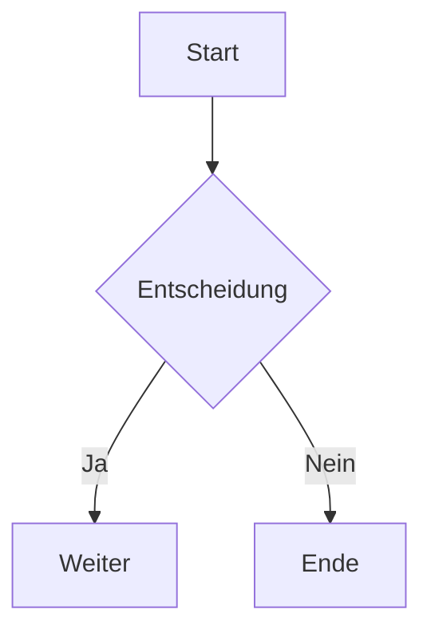

 \
 \
 \
 \
### Traveling Salesman Problem (TSP)

---

- NP-Schweres Problem
Eine Klasse an Problemen für die es noch nicht die
---

## Animationen

<!-- Add transition effects -->

- Punkt 1 <!-- _class: fade-in -->
- Punkt 2 <!-- _class: fade-in -->
- Punkt 3 <!-- _class: fade-in -->

---

## Diagramme mit Mermaid

---

## Benutzerdefinierte Layouts

### Linke Seite
- Punkt 1
- Punkt 2

### Rechte Seite
- Punkt A
- Punkt B

---

## Erweiterte Bilder

---

## Tabellen mit Stil

| Spalte 1 | Spalte 2 | Spalte 3 |
|----------|----------|----------|
| Zelle 1  | Zelle 2  | Zelle 3  |
| Zelle 4  | Zelle 5  | Zelle 6  |

---

# Vielen Dank!

Kontakt: [email@example.com](mailto:email@example.com)

